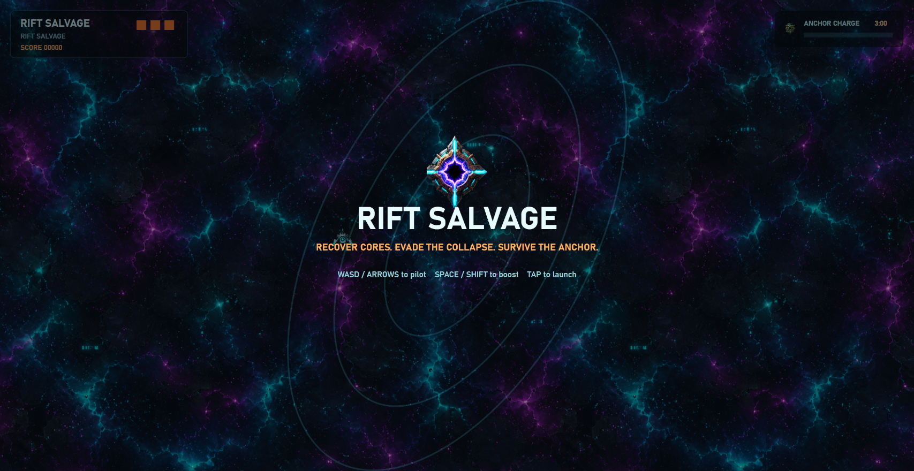

```terminal
> whoami
```

<div align="center">

[](https://git.io/typing-svg)

</div>

---

```terminal
$ cat about.txt
```

**Currently**
- Building browser-based games with TypeScript & Canvas
- Exploring game architecture patterns & ECS design
- Performance optimization for 60fps rendering

**Interests**
- Game development & interactive experiences
- Web graphics & animation
- Clean code & design patterns

---

```terminal
$ cat preview.png
```

<p align="center">
  
</p>

---

```terminal
$ cat /etc/tech-stack.conf
```

<p>
  
  
  
  
  
  
  
  
</p>

---

```terminal
$ cat /proc/contributions
```

<p align="center">
  
</p>

[](https://github.com/Ashutosh00710/github-readme-activity-graph)

---

```terminal
$ cat social.txt
```

<p>
  <a href="https://github.com/KkOma-value"></a>
  <a href="mailto:lijinhang460@gmail.com"></a>
</p>

<p align="center">
  
</p>
